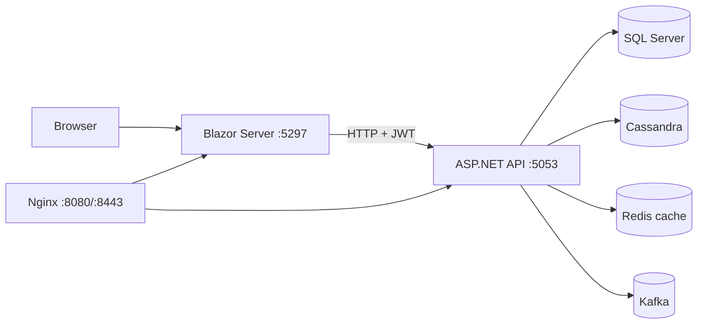

# EduPlatform - Etat du projet et guide d'exploitation

**Etat verifie le : 2026-09-29**  
**Branche de reference :** `main`
**Public :** developpeurs, administrateurs de la stack et responsables du deploiement.

Ce document decrit le comportement constate dans le depot. Pour les routes HTTP, les attributs des controllers et les DTO sont la source de verite. `docs/API_DOCUMENTATION.md`, `docs/ARCHITECTURE.md`, `docs/DEPLOYMENT.md` et `docs/REMAINING_TASKS.md` contiennent encore des exemples historiques qui ne doivent pas etre copies sans verification.

---

## 1. Resume d'etat

| Domaine | Etat constate | A retenir |
|---|---|---|
| Web Blazor | Operationnel | Blazor Server .NET 8, rendu interactif et appels REST a l'API |
| API REST | Operationnelle | ASP.NET Core 8, JWT Bearer, Swagger |
| SQL Server | Operationnel en Docker | Donnees relationnelles, migrations EF Core au demarrage dans Compose |
| Cassandra | Conteneur operationnel | Schema d'initialisation aligne sur les repositories pour les installations neuves |
| Redis | Operationnel | Cache best-effort pour catalogue, detail, statistiques et categories |
| Kafka | Operationnel | Producteur et consumer d'activites; consumer actuellement surtout observabilite/log |
| Nginx | Operationnel localement | Reverse proxy HTTP/HTTPS, certificat local auto-signe |
| Kubernetes | Non configure | Aucun manifest, Helm chart, ingress ou StatefulSet dans le depot |
| CI | Presente | Build, tests/couverture, Docker Compose et deux suites E2E |
| Tests verifies | 44 tests .NET + 2 suites Playwright | Les tests unitaires n'exercent pas toutes les integrations Cassandra/API |

Derniere validation locale documentee : build Release, 44/44 tests .NET, smoke E2E et workflow E2E publication/moderation passes; conteneurs Docker sains. Reexecuter les commandes de la section 6 apres toute modification.

### Points de vigilance prioritaires

1. Les bases Cassandra deja initialisees avec l'ancien `test_results` (`submitted_at`, `test_id`) ne sont pas converties par `CREATE TABLE IF NOT EXISTS`; elles necessitent une migration de donnees planifiee.
2. L'historique interroge Cassandra une fois par cours inscrit (paquets paralleles de 16, au plus 100 lignes par partition), puis fusionne les evenements recents; le cout augmente avec le nombre d'inscriptions.
3. Le healthcheck Compose utilise `/health/details`, qui controle SQL Server et la connectivite TCP Cassandra/Redis/Kafka. Ces tests ne verifient pas les operations applicatives de lecture/ecriture.
4. Paiement simule, TLS local auto-signe, ports API/Web publies directement par Compose. Ce n'est pas une configuration de production publique.
5. Les fichiers `docs/ROADMAP_STATUS.md` et `docs/REMAINING_TASKS.md` ont des statuts qui ne refletent pas tous le code recent. Les pourcentages sont des estimations, pas une mesure automatique.

---

## 2. Structure du depot

```text
EduPlatform.API/       API ASP.NET Core, controllers, middleware, configuration
EduPlatform.Web/       Blazor Server, pages Razor, composants partages, wwwroot
EduPlatform.Core/      Entites metier et services sans acces direct aux bases
EduPlatform.Data/      EF Core SQL Server, Cassandra repositories, cache Redis, migrations
EduPlatform.BigData/   Producteur/consumer Kafka, analytics et recommandations ML.NET
EduPlatform.Tests/     Tests xUnit (Core, controllers instancies directement, InMemory)
scripts/               Initialisation, Kafka/Cassandra/SQL, sauvegardes, E2E
nginx/                 Reverse proxy et certificats de developpement
.github/workflows/     Pipeline GitHub Actions
Dockerfile.api         Image API
Dockerfile.web         Image Blazor
Docker-compose.yml     Stack locale complete
```

### Responsabilites

- **Web** : rendu etat UI, restauration de session locale, appels `HttpClient` nomme `EduPlatformAPI`. L'authentification utilisateur est geree par `AuthStateService` et le bearer token.
- **API** : controllers REST, authorization par roles, orchestration EF Core/Cassandra/Kafka/Redis et validation des donnees.
- **Core** : entites partagees et helpers metier reutilisables (`AuthService`, `CourseMediaValidator`, `LessonHtml`, paiement demo).
- **Data** : SQL Server est configure par `EduDbContext`; Cassandra par `CassandraContext` et repositories; Redis par `CacheService`.
- **BigData** : `EventProducer`, `ActivityConsumer`, `AnalyticsService`, `RecommendationService`.

### Flux simplifie



---

## 3. Ports, URLs et configuration

### Ports Docker locaux

| Service | Port hote | Port conteneur | Usage |
|---|---:|---:|---|
| Web | 5297 | 8080 | `http://localhost:5297` |
| API | 5053 | 8080 | `http://localhost:5053` |
| Nginx HTTP | 8080 | 80 | Redirige vers HTTPS |
| Nginx HTTPS | 8443 | 443 | `https://localhost:8443` (certificat auto-signe) |
| SQL Server | 1433 | 1433 | Connexion SQL locale |
| Cassandra | 9042 | 9042 | CQL |
| Kafka | 9092 | 9092 | Bootstrap local |
| Redis | 6379 | 6379 | Cache |
| Zookeeper | 2181 | 2181 | Coordination Kafka |

Dans le reseau Compose, les services utilisent les noms DNS `api`, `web`, `sqlserver`, `cassandra`, `redis`, `kafka`, `zookeeper`; l'API ecoute sur `8080`.

### Variables attendues par Docker Compose

Definir dans chaque nouvelle session PowerShell ou utiliser un gestionnaire de secrets local :

```powershell
$env:SQLSERVER_SA_PASSWORD = "<mot-de-passe-fort-local>"
$env:JWT_SECRET_KEY = "<cle-aleatoire-d-au-moins-32-caracteres>"
$env:OPENAI_API_KEY = "<cle-si-le-chatbot-est-utilise>"
```

`SQLSERVER_SA_PASSWORD` et `JWT_SECRET_KEY` sont obligatoires. `OPENAI_API_KEY` est facultative au demarrage, mais le chatbot necessite un acces OpenAI valide. Ne jamais committer ces valeurs.

Configuration API pertinente : `ConnectionStrings:SqlServer`, `Cassandra:Host/Port/Keyspace/Username/Password`, `Redis:ConnectionString`, `Kafka:BootstrapServers`, `Kafka:TopicActivity`, `Jwt:*`, `OpenAI:*`, `PublicBaseUrl`, `Database:ApplyMigrations`, `DataProtection:KeysPath`.

Configuration Web : `Api:BaseUrl` et `DataProtection:KeysPath`.

---

## 4. API REST : conventions, roles et endpoints

### Conventions d'appel

- Prefixe : `/api`.
- En local Compose : `http://localhost:5053`; Swagger : `/swagger`.
- Authentification : `Authorization: Bearer <JWT>` sauf routes publiques indiquees.
- Roles : `Student`, `Instructor`, `Admin`. Les controllers declarent leur securite avec `[Authorize]`, `[Authorize(Roles=...)]` et quelques `[AllowAnonymous]`.
- 401 signifie token absent/invalide ou session refusee; 403 signifie identite valide sans autorisation/inscription; 404 ressource absente; 400 validation metier; 409 conflit/doublon. Les messages sont souvent JSON `{ "message": "..." }`.
- Le JWT contient identifiant utilisateur, email, role et prenom. Les refresh tokens sont rotatifs, stockes en SQL, expires selon `Jwt:RefreshTokenExpirationDays` (30 par defaut).
- L'API ajoute correlation/logs via `RequestCorrelationMiddleware` et `SecurityAuditMiddleware`.

### Authentification - `AuthController`

| Methode et route | Acces | Fonction |
|---|---|---|
| `POST /api/auth/register` | Public | Cree un Student, hash BCrypt, retourne JWT et refresh token |
| `POST /api/auth/login` | Public | Verifie credentials et suspension; retourne JWT et refresh token |
| `POST /api/auth/refresh` | Public + refresh token | Revoque le token courant et emet une paire rotative |
| `POST /api/auth/logout` | Public + refresh token | Revoque le refresh token s'il existe |
| `GET /api/auth/me` | Authentifie | Profil de l'utilisateur du JWT |
| `PUT /api/auth/profile` | Authentifie | Modifie prenom/nom |
| `POST /api/auth/change-password` | Authentifie | Verifie ancien mot de passe et remplace le hash |

L'inscription assigne toujours le role Student; le role n'est pas librement choisi dans le DTO public.

### Cours, modules, publication - `CoursesController`

| Methode et route | Acces | Fonction et controles principaux |
|---|---|---|
| `GET /api/courses?category=&level=` | Public | Catalogue publie/non archive; filtres optionnels; liste optimisee avec compteurs et note |
| `GET /api/courses/categories` | Public | Categories actives ayant des cours publies, mises en cache |
| `GET /api/courses/stats` | Public | Statistiques du catalogue |
| `GET /api/courses/{id}` | Public / proprietaire / Admin | Detail public; brouillon visible seulement au proprietaire/Admin authentifie |
| `GET /api/courses/mine` | Instructor/Admin | Cours appartenant a l'instructeur, ou tous les cours pour Admin |
| `GET /api/courses/instructor-analytics` | Instructor/Admin | Inscriptions et resultats de quiz par cours |
| `POST /api/courses` | Instructor/Admin | Cree un brouillon; titre, description, categorie, duree et prix valides |
| `PUT /api/courses/{id}` | Proprietaire/Admin | Modifie les metadonnees du cours |
| `POST /api/courses/{id}/modules` | Proprietaire/Admin | Cree un module; description HTML assainie |
| `PUT /api/courses/{courseId}/modules/{moduleId}` | Proprietaire/Admin | Modifie module; description assainie |
| `DELETE /api/courses/{courseId}/modules/{moduleId}` | Proprietaire/Admin | Supprime un module |
| `POST /api/courses/{courseId}/modules/{moduleId}/video` | Proprietaire/Admin | Upload MP4/WebM/OGG, 100 MB maximum, validation extension/MIME |
| `POST /api/courses/{id}/thumbnail` | Proprietaire/Admin | Upload JPG/JPEG/PNG/WebP, 10 MB maximum; controle extension |
| `GET /api/courses/pending` | Admin | File de validation |
| `POST /api/courses/{id}/submit-for-review` | Proprietaire/Admin | Soumet un cours avec au moins un module; Draft/Rejected seulement |
| `POST /api/courses/{id}/approve` | Admin | Approuve et publie le cours en attente |
| `POST /api/courses/{id}/reject` | Admin | Rejette avec motif obligatoire |
| `POST /api/courses/{id}/publish` | Proprietaire/Admin | Publication; cours approuve requis pour Instructor |
| `POST /api/courses/{id}/unpublish` | Proprietaire/Admin | Depublie et invalide cache |
| `POST /api/courses/{id}/archive` | Proprietaire/Admin | Depublie et archive sans suppression physique |
| `POST /api/courses/{id}/restore` | Proprietaire/Admin | Restaure en brouillon non publie |
| `DELETE /api/courses/{id}?confirm=DELETE` | Admin | Supprime uniquement un cours archive |
| `POST /api/courses/{id}/enroll` | Authentifie | Inscription simple aux cours gratuits seulement |
| `GET /api/courses/{id}/enrollment-status` | Authentifie | Renvoie un booleen d'inscription |
| `GET /api/courses/{id}/students` | Proprietaire/Admin | Liste des inscrits/progression |

Les uploads sont ecrits sous `wwwroot/uploads/courses/<courseId>` dans le conteneur API. Le volume Compose `api_uploads` les preserve lors d'un rebuild local.

### Progression et inscriptions - `ProgressController`

| Methode et route | Acces | Fonction |
|---|---|---|
| `GET /api/progress/enrollments` | Authentifie | Inscriptions et progression estimee depuis le temps d'activite |
| `GET /api/progress/course/{courseId}/modules` | Authentifie | Progression module par module |
| `POST /api/progress/module` | Authentifie et inscrit | Sauvegarde position/ratio; complete automatiquement a 90 %, ou avec `markCompleted` |
| `GET /api/progress/continue?limit=3` | Authentifie | Cours a reprendre, limite bornee a 1..10 |
| `POST /api/progress/enroll` | Authentifie | Inscription au plan Free/Standard/Premium; controle du montant, passerelle demo pour plans payants seulement et notification |
| `POST /api/progress/log` | Authentifie | Journalise une action; best-effort Cassandra/Kafka |
| `GET /api/progress/{courseId}` | Authentifie | Temps total passe dans le cours |
| `GET /api/progress/history` | Authentifie | Historique recent Cassandra |

### QCM - `TestsController`

| Methode et route | Acces | Fonction |
|---|---|---|
| `GET /api/tests/{courseId}` | Authentifie et inscrit | Questions publiques du QCM sans reponses correctes |
| `GET /api/tests/{courseId}/manage` | Proprietaire/Admin | Questions avec reponses pour gestion |
| `POST /api/tests/{courseId}/questions` | Proprietaire/Admin | Ajout question/options/reponse correcte |
| `PUT /api/tests/{courseId}/questions/{questionId}` | Proprietaire/Admin | Modification question |
| `DELETE /api/tests/{courseId}/questions/{questionId}` | Proprietaire/Admin | Suppression question |
| `POST /api/tests/{courseId}/submit` | Authentifie et inscrit | Corrige, persiste resultat Cassandra, notifie; seuil de reussite 60 % |
| `GET /api/tests/{courseId}/analytics` | Proprietaire/Admin | Tentatives, score moyen, taux de reussite |

Les effets Kafka/Cassandra lors de la soumission sont best-effort et limites dans le temps pour ne pas bloquer la reponse HTTP.

### Avis - `ReviewsController`

| Methode et route | Acces | Fonction |
|---|---|---|
| `GET /api/reviews/course/{courseId}` | Public | Moyenne, total et avis |
| `POST /api/reviews/course/{courseId}` | Authentifie et inscrit | Cree/met a jour l'avis de l'apprenant (note 1..5, commentaire <= 2000 caracteres) |
| `POST /api/reviews/{reviewId}/report` | Authentifie et inscrit au cours | Signale un avis tiers; motif obligatoire <= 1000 caracteres; doublon refuse |

### Administration - `AdminController` (`Admin` requis sur toutes les routes)

| Methode et route | Fonction |
|---|---|
| `GET /api/admin/users` | Liste utilisateurs, roles et suspension |
| `GET /api/admin/overview` | Statistiques globales |
| `GET /api/admin/reviews` | Avis et historique des signalements |
| `DELETE /api/admin/reviews/{id}` | Supprime un avis; FK supprime ses signalements en cascade |
| `GET /api/admin/categories` | Liste categories, synchronise les categories historiques depuis les cours |
| `POST /api/admin/categories` | Cree une categorie unique |
| `PUT /api/admin/categories/{id}/toggle` | Active/desactive une categorie |
| `GET /api/admin/reports/courses.csv` | Exporte un CSV |
| `PUT /api/admin/users/{id}/role` | Change role |
| `PUT /api/admin/users/{id}/suspend` | Suspend compte |
| `PUT /api/admin/users/{id}/reactivate` | Reactive compte |

### Autres controllers

| Controller | Routes principales | Acces / remarque |
|---|---|---|
| `GET /api/recommendations` | Recommandations, notes, raisons | Authentifie |
| `POST /api/recommendations/train` | Entrainement ML.NET | Admin |
| `GET /api/notifications` | 50 notifications recentes du compte | Authentifie |
| `POST /api/notifications/{id}/read` | Marque lue | Propriete verifiee par user ID |
| `POST /api/notifications/send` | Envoi a apprenant | Instructor/Admin; instructeur limite a ses propres inscrits |
| `GET /api/certificates/{courseId}` | Certificat JSON si inscrit et test reussi | Authentifie; pas de PDF/QR |
| `POST /api/chatbot/message` | Envoie message et persiste historique | Authentifie; depend d'OpenAI et du schema Cassandra chatbot |
| `GET /api/chatbot/history/{sessionId}` | Historique chatbot | Authentifie et scope par utilisateur |
| `GET /health` | Healthcheck ASP.NET generique | Public; Compose l'utilise actuellement |
| `GET /health/details` | Verifie SQL/Cassandra/Redis/Kafka par connexion | Public; retourne 503 si une connexion echoue |
| `/swagger` | Swagger UI | Expose par API; securiser/limiter en production selon politique |

Les signatures exactes, DTO et statuts sont dans `EduPlatform.API/Controllers`. L'ancien `docs/API_DOCUMENTATION.md` contient des routes/exemples fictifs (pagination, rate limit et ports locaux historiques); verifier le controller avant d'integrer un client.

### Maintenir/ajouter une API

1. Definir methode, route, role et contrat JSON avant le code; eviter de retourner les entites EF directement si la reponse contient des donnees privees.
2. Declarer le role au niveau controller/action et verifier l'appartenance a la ressource (cours/inscription), pas seulement l'authentification.
3. Valider toutes les entrees cote serveur; les validations Web ne sont pas une barriere de securite.
4. Garder les controllers simples quand une regle est partagee; placer les regles reutilisables dans Core/Services.
5. Invalider les cles Redis concernees apres toute mutation (cours, categories, stats).
6. Pour les effets Kafka/Cassandra non indispensables a la reponse, ne pas tenir la requete ouverte indefiniment; journaliser echec/timeout.
7. Ajouter tests unitaires des regles/roles/erreurs et E2E si le parcours touche plusieurs services.
8. Mettre a jour Swagger/contrat et ce guide; tester anon, Student, Instructor, Admin, proprietaire non-proprietaire.

---

## 5. Donnees et persistance

### SQL Server / EF Core

`EduDbContext` porte les entites relationnelles : `Users`, `Courses`, `Modules`, `Enrollments`, `Questions`, `Notifications`, `RefreshTokens`, `CourseCategories`, `CourseReviews`, `CourseReviewReports`, `ModuleProgresses`.

Regles notables : email unique; inscription cle composee (UserId, CourseId); review unique par (CourseId, UserId); report unique par (ReviewId, ReporterId); module progress unique par (UserId, ModuleId); statut de cours stocke comme enum texte. Les migrations sont dans `EduPlatform.Data/Migrations`.

12 migrations source sont presentes au 2026-09-29. Dans Compose, l'API applique `Database__ApplyMigrations=true` au demarrage. En local hors Compose, utiliser `dotnet ef database update --project EduPlatform.Data --startup-project EduPlatform.API`.

**Alerte migration avis :** `20260921203940_AddCourseReviewReports` est vide. `20260929003016_CreateCourseReviewReportsTable` cree ensuite la table avec garde `OBJECT_ID`; ne pas la supprimer ni renommer sans analyser les `__EFMigrationsHistory` des bases deja installees.

Commandes EF usuelles (depuis racine) :

```powershell
dotnet ef migrations list --project EduPlatform.Data --startup-project EduPlatform.API
dotnet ef migrations add NomDescriptif --project EduPlatform.Data --startup-project EduPlatform.API --output-dir Migrations
dotnet ef database update --project EduPlatform.Data --startup-project EduPlatform.API
```

Toujours inspecter le `Up`, `Down` et le snapshot; valider sur base jetable avant toute production. Ne jamais reinitialiser le volume SQL pour contourner une migration.

### Backup et restore SQL

`scripts/sqlserver/backup-database.ps1` et `restore-database.ps1` sont configures par defaut pour SQL Server local Windows (`.\SQLEXPRESS` et authentification integree). Ils ne sont **pas directement configurables en SQL auth Docker** : adapter les scripts ou utiliser `sqlcmd` dans le conteneur.

Dans Compose, faire un backup dans le volume SQL persistant :

```powershell
$stamp = Get-Date -Format 'yyyyMMdd-HHmmss'
docker exec sqlserver_edu mkdir -p /var/opt/mssql/backup
docker exec -e "SQLCMDPASSWORD=$env:SQLSERVER_SA_PASSWORD" sqlserver_edu /opt/mssql-tools18/bin/sqlcmd -S localhost -U sa -C -b -Q "BACKUP DATABASE [EduPlatformDB] TO DISK=N'/var/opt/mssql/backup/EduPlatformDB-$stamp.bak' WITH INIT,CHECKSUM,STATS=10"
```

Copier ensuite le fichier hors du conteneur pour qu'il survive a une perte du volume :

```powershell
docker cp "sqlserver_edu:/var/opt/mssql/backup/EduPlatformDB-$stamp.bak" .\backups\
```

Pour restaurer, arreter les writers, copier le backup dans le conteneur, lancer `RESTORE DATABASE ... WITH REPLACE, RECOVERY`, puis redemarrer l'API. Faire un restore drill periodique; un backup non restaure n'est pas une sauvegarde valide.

### Cassandra

`CassandraContext` se connecte au keyspace `edu_platform`; en Compose le contact point est le service `cassandra`, port 9042. Initialisation manuelle :

```powershell
Get-Content scripts/cassandra/init.cql | docker exec -i cassandra_edu cqlsh
Get-Content scripts/cassandra/002_add_activity_session_id.cql | docker exec -i cassandra_edu cqlsh
```

Le script declare `user_activities`, `test_results`, `chat_messages` et `chatbot_sessions`; le second ajoute `session_id` aux installations historiques. Le schema `test_results` est aligne sur `TestResultRepository` pour une installation neuve. `CREATE TABLE IF NOT EXISTS` ne change pas la cle primaire d'une ancienne table; faire une migration/export-import explicite avant upgrade d'une base creee avec l'ancien schema. Donnees temporelles/analytique et conversations doivent etre sauvegardees separativement du volume SQL. En dev, `nodetool snapshot edu_platform -t <nom>` cree un snapshot local; exporter/copier le snapshot hors du volume et tester le restore avant de compter dessus.

**Gaps Cassandra restants :**

- L'historique fait un fan-out sur les cours inscrits; si un compte accumule beaucoup de cours, concevoir une table/index de lecture utilisateur avec backfill.
- Les tests xUnit/InMemory ne valident pas les requetes CQL; maintenir une verification d'integration contre Cassandra.

Ne pas changer une cle primaire Cassandra en place sans migration de donnees et plan de bascule; concevoir une nouvelle table par modele de requete est souvent necessaire.

### Redis

Cache best-effort: `CacheService` ignore actuellement les exceptions Get/Set/Delete (l'app doit rester utilisable si Redis tombe). Cles connues : `course:{id}`, `courses:all:v2`, `courses:stats`, `courses:categories`, `progress:{user}:{course}`. Les mutations cours invalident detail/liste/stats/categories selon les actions. Diagnostic : `docker exec redis_edu redis-cli ping` (attendu `PONG`). `docker compose restart redis` ne supprime pas le volume d'aucune autre base.

### Kafka

Compose fournit un broker unique, replication factor 1 et Zookeeper : configuration de developpement, sans HA. Les clients dans le reseau Docker doivent utiliser `kafka:29092`; les outils lances sur l'hote utilisent `localhost:9092`. Ne pas annoncer `localhost` aux clients conteneurises : Kafka retourne l'adresse annoncee dans ses metadonnees. Les donnees broker persistent dans le volume nomme `eduplatform_kafka_data`. `scripts/kafka/init-topics.ps1` cree cinq topics (retention 1 a 90 jours). Producteur publie `user-activity-events` et `test-results-events`; consumer actif ecoute `user-activity-events`, log puis commit l'offset. Il ne fait pas de traitement analytique durable actuellement. Les autres topics ne sont pas tous consommes par le code actuel.

Commandes :

```powershell
docker exec kafka_edu kafka-topics --bootstrap-server localhost:9092 --list
docker exec kafka_edu kafka-consumer-groups --bootstrap-server localhost:9092 --list
docker logs --tail 200 kafka_edu
```

---

## 6. Demarrage, maintenance et diagnostic

### Demarrer / mettre a jour la stack

```powershell
$env:SQLSERVER_SA_PASSWORD = "<mot-de-passe-local>"
$env:JWT_SECRET_KEY = "<cle-jwt-32-caracteres-minimum>"
docker compose up -d --build
docker compose ps
```

`SEED_DEMO_DATA=true` n'est consomme que par `scripts/init-platform.ps1` pour charger des exemples; ne pas activer les donnees demo dans une base de production.

Commandes usuelles :

```powershell
docker compose logs -f api
docker compose logs -f web
docker compose logs --tail 200 sqlserver
docker compose restart api
docker compose config --quiet
dotnet build EduPlatform.sln --configuration Release
dotnet test EduPlatform.Tests/EduPlatform.Tests.csproj --configuration Release
Push-Location scripts/e2e; npm ci; npx playwright install chromium; npm test; Pop-Location
```

- `docker compose down` arrete/supprime les conteneurs, conserve normalement les named volumes.
- **Ne pas utiliser `docker compose down -v` sur une stack avec donnees a conserver** : cela supprime SQL Server, Cassandra et volumes de cle Data Protection/uploads.
- Un rebuild API/Web ne doit pas effacer les fichiers uploadees : le volume `api_uploads` est requis.
- Apres changement de migration, redemarrer l'API puis controler logs, `/health/details` et les tables attendues.

### Sante et observabilite

- `GET /health` est le liveness endpoint mappe par ASP.NET; aucun `AddCheck(...)` n'est enregistre dans `Program.cs`. Il confirme que le process API repond.
- `GET /health/details` est le readiness endpoint utilise par le healthcheck Compose. Il teste SQL par `CanConnectAsync` (un resultat `false` est unhealthy) et Cassandra/Redis/Kafka par TCP. Cela ne valide ni les tables CQL, ni les lectures/ecritures Kafka/Redis. Utiliser en complement les commandes propres a chaque service.
- `RequestCorrelationMiddleware` ajoute le contexte de correlation; `SecurityAuditMiddleware` trace notamment acces refuses/5xx/latence.
- Serilog, Prometheus, Grafana et OpenTelemetry ne sont pas installes au 2026-09-29.

### Nginx / TLS

Nginx redirige HTTP vers HTTPS et passe `X-Forwarded-*` ainsi que WebSocket pour Blazor. Les certificats sous `nginx/certs` sont auto-signes/dev. Avant Internet : nom DNS public, ACME/autorite reconnue, renouvellement automatique, fermer ports directs API/Web, secrets externalises, TLS valide et test de restauration.

### Kubernetes

**Aucun support Kubernetes n'est present dans ce depot** : pas de manifests YAML, Helm chart, Kustomize, Ingress, Secret/ConfigMap, Deployment ou StatefulSet. Compose est la seule orchestration fournie. Une migration K8s necessitera entre autres stockage persistant SQL/Cassandra, secrets, probes, ingress TLS, politique de sauvegarde, limites CPU/memoire, autoscaling et separation des services stateful/stateless. Ne pas interpreter la mention de `kubectl` dans les anciens guides comme une plateforme deja configuree.

---

## 7. Tests et CI

Commande tests unitaires :

```powershell
dotnet test EduPlatform.Tests/EduPlatform.Tests.csproj --configuration Release
```

Les 44 tests actuels couvrent AuthService, paiement demo, validateur medias, controller avis, controller admin avis et sanitiseur HTML. Les controllers sont instancies directement avec EF InMemory; ce n'est pas equivalent a une integration HTTP contre SQL Server/Cassandra.

E2E local :

```powershell
Push-Location scripts/e2e
npm ci
npx playwright install chromium
npm test
Pop-Location
```

`npm test` execute `smoke-tests.mjs` puis `publication-moderation.mjs`. Cette derniere suite cree des donnees SQL temporaires, ecrit/lit un resultat QCM dans Cassandra via analytics et certificat, puis nettoie le cours et les partitions Cassandra en `finally`; verifier les logs `Nettoyage` apres un echec.

CI `.github/workflows/ci.yml` : build Release, tests avec Coverlet, rapport d'artefact, seuil de couverture `45 %`, validation Compose, build images, stack ephemere et E2E. Le rapport mesure precedemment environ 47.1 % global, avec couverture API faible et BigData non couvert; le seuil 45 % est un garde-fou, pas l'objectif de qualite.

---

## 8. Etat restant et priorites

### P0 - Fiabilite des donnees externes

- Tester l'initialisation CQL sur une base vide et definir un chemin de migration pour les installations qui ont l'ancienne cle primaire de `test_results`.
- Remplacer le fan-out de l'historique par un index/table de lecture utilisateur si le volume de cours par compte augmente.
- Ajouter des probes separees liveness/readiness et des checks applicatifs CQL/Kafka/Redis au-dela d'une simple connexion TCP.

### P1 - Qualite et securite

- Couverture API/BigData > 80 % (mesure documentee 47.1 %).
- Tests `WebApplicationFactory`, Cassandra et Redis.
- Tests accessibilite axe/Lighthouse en CI.
- Rate limiting; verification duree de vie/rotation et secrets JWT en environnement deploye.
- Pages legales/confidentialite avant ouverture publique.

### P1 - Production/operations

- Certificat TLS public renouvele automatiquement.
- Fermer ports 5053/5297 au public derriere Nginx/load balancer.
- Registre d'images, deploiement automatise, rollback et alertes.
- Backup/restore SQL Docker documente/teste; plan snapshot/restore Cassandra; RPO/RTO.
- Logs centralises, Serilog, metriques et tracing.

### P2 - Produit/echelle

- Stockage objet/CDN, transcodage HLS/DASH, sous-titres.
- Ressources telechargeables, certificat PDF/QR, analytics de distribution des notes.
- Paiement reel : actuellement simule et gele par decision produit.
- Kubernetes : futur chantier, pas une tache d'exploitation deja disponible.

### Documents a remettre en coherence

- `docs/API_DOCUMENTATION.md` contient des exemples historiques (ports, routes/tests/results, rate limits et pagination generiques) qui ne correspondent pas tous au code.
- `docs/REMAINING_TASKS.md` marque des fonctionnalites deja realisees comme restantes.
- `docs/IMPROVEMENTS.md` contient egalement des constats UI anterieurs aux derniers changements.
- `docs/ROADMAP_STATUS.md` est plus recent mais certains chiffres (24 tests dans les anciennes sections) sont a recaler sur 44 tests actuels et la couverture CI courante.

---

## 9. Regles de maintenance

- Ne jamais committer secrets, tokens, mots de passe, `.env`, backups SQL ou donnees personnelles.
- Ne pas supprimer de volumes pour "reparer" une migration; sauvegarder, diagnostiquer l'historique EF, corriger de facon additive.
- Avant upgrade d'image SQL/Cassandra/Kafka/Redis : lire release notes, faire backup, tester restore et compatibilite locale.
- Pour toute modification de schema SQL : migration EF, revue `Up/Down`, migration sur base vierge et base precedente, tests API.
- Pour CQL : migration additive versionnee sous `scripts/cassandra`; les CQL existants ne sont pas executes automatiquement par Compose.
- Pour cache : ajouter une cle versionnee si le schema des objets serialises change et invalider les mutations.
- Pour API : tester 401/403/404/400, propriete de ressource et effet secondaire data/cache/event.
- Pour medias : tester taille/type, chemin persistant, accessibilite depuis Web/API et nettoyage des fichiers orphelins.
- Avant push/deploiement : Release build, tests .NET, `npm test`, `docker compose config --quiet`, et `GET /health/details`.
